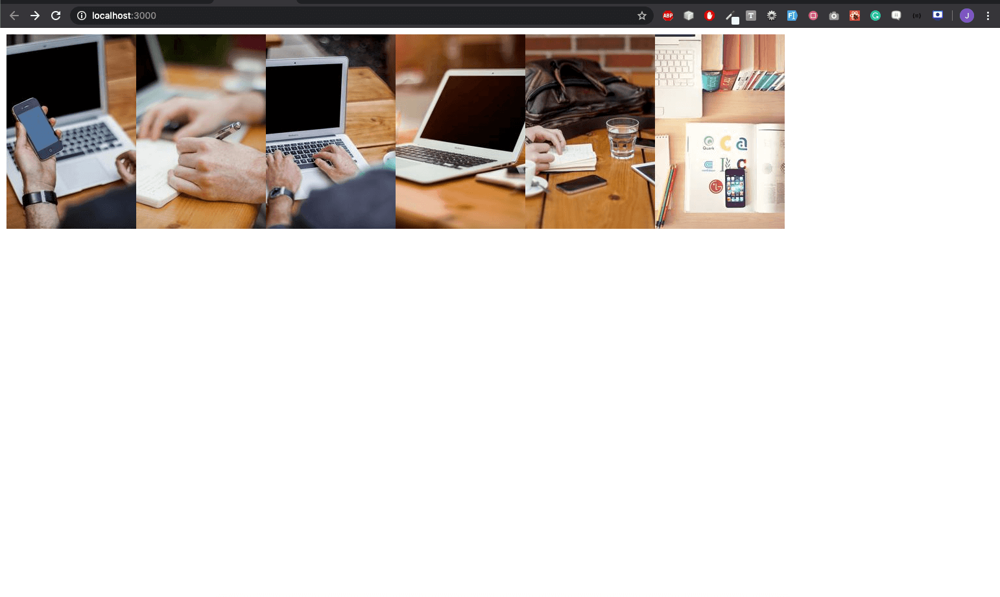

# Rendering Items in an Array

In Visual Studio code, press `command+shift+v` (Mac) or `ctrl+shift+v` (Windows) to open a Markdown preview.

## Getting Started

Using your command line, you will need to navigate to the this folder, install all dependencies, and start the app.

```bash
cd exercises/01-arrays/
code . # if you would like to open this in a separate VSCode window
yarn install
yarn start
```

If, at any time, you need to stop the app, press `ctrl+c`.

## Reason for the challenge

As a front end developer, rendering items to screen is an important skill to have.
In this challenge, you will be tasked with rendering a series of images to the screen.
Styling is not important in this challenge, but using the [.map function](https://developer.mozilla.org/en-US/docs/Web/JavaScript/Reference/Global_Objects/Array/map) is vital.

## Developer Instructions

1. Import the images from the image directory.
2. Iterate over each image and render them to the screen.

## Example



## Image Credits

- ["Printing Press, Declaration of Independence, Boston Mass"](https://search.creativecommons.org/photos/844b7232-1876-4746-9294-527c101c6de0) by dog97209 is licensed with CC BY-NC-ND 2.0. To view a copy of this license, visit https://creativecommons.org/licenses/by-nc-nd/2.0/
- ["Forgotten Typewriter"](https://search.creativecommons.org/photos/52e765c1-869d-428f-ae5a-99d6102b18ca) by petesimon is licensed with CC BY 2.0. To view a copy of this license, visit https://creativecommons.org/licenses/by/2.0/
- ["Hewlett-Packard Model 85 Personal Computer"](https://search.creativecommons.org/photos/0dd6fd7a-0d3d-4110-a390-d37046d27c09) by dvanzuijlekom is licensed with CC BY-SA 2.0. To view a copy of this license, visit https://creativecommons.org/licenses/by-sa/2.0/
- ["Hard at work 6/365"](https://search.creativecommons.org/photos/b878e4d7-47b3-4223-9981-7f9304b6086f) by Louish Pixel is licensed with CC BY-NC-ND 2.0. To view a copy of this license, visit https://creativecommons.org/licenses/by-nc-nd/2.0/
