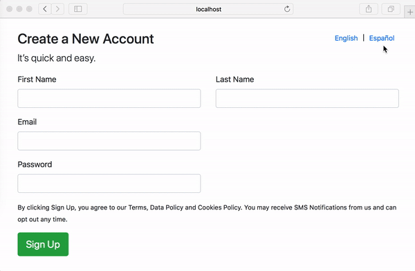

# Context API Challenge 1 - Basic Example

In Visual Studio code, press `command+shift+v` (Mac) or `ctrl+shift+v` (Windows) to open a Markdown preview.

## Reasons for the Challenge

The purpose of this challenge is to introduce you to the Context API, which is designed to share state between multiple components.

## Example

```jsx
// import useContext and createContext
import { useContext, createContext } from "react";

// Create a Context
const NumberContext = createContext();
// It returns an object with 2 values:
// { Provider, Consumer }

function App() {
  // Use the Provider to make a value available to all
  // children and grandchildren
  return (
    <NumberContext.Provider value={42}>
      <div>
        <Display />
      </div>
    </NumberContext.Provider>
  );
}

function Display() {
  // Use the useContext to grab the value from context
  // Notice this component didn't get any props!
  const value = useContext(NumberContext);
  return <div>The answer is {value}.</div>;
}
```

Source: https://daveceddia.com/usecontext-hook/

## Getting Started

Using your command line, you will need to navigate to the this folder, install all dependencies, and start the app.

```bash
cd exercises/09a-context-api/
code . # if you would like to open this in a separate VSCode window
npm install
npm start
```

If, at any time, you need to stop the app, press `ctrl+c`.

## User Stories

As a user, I would like to click a button to switch the language between English ("en") and Spanish ("es").



## Instructions

When you start the application, it is fully functional. However, you will be refactoring the code in _src/App.jsx_ so that "CreateAccount" relies on the Context API instead of local state.

## Acceptance Criteria

- You must use the Context API to store both the language locale ("en" or "es") and the update callback function "setLanguage".
- The "CreateAccount" component should not be using local state. It must get "language" and "setLanguage" from the Context API.
- When the user clicks on "English" or "Spanish", it should change all the copy inside of the "CreateAccount" component to match the desired language.

Note that you do not need to make the forms functional.
